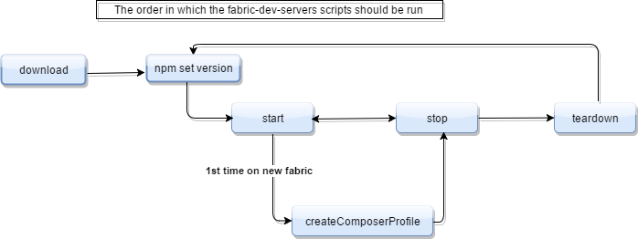

# fabric-dev-servers

This repository contains a number of helper scripts to start up a Hyperledger Fabric v1.0
network for development purposes. You can use the Hyperledger Fabric network created by these scripts to quickly deploy Blockchain business networks built using Hyperledger Composer, and test applications that depend on a running network.

This package is also available inside the `composer-data` directory that is created via the [local installer] for Hyperledger Composer: [Installing and running Hyperledger Composer Playground locally](https://hyperledger.github.io/composer/installing/using-playground-locally.html)

# Usage

## Step 1: Getting Hyperledger Fabric running

These scripts use bash and Docker. You must ensure that both bash and Docker are installed on the target system before running these scripts.

1. In a directory of your choice (these instructions will assume `~/fabric-tools`), download the archive file that contains these tools. There are both .zip and .tar.gz formats - select one of these options:

```
$ mkdir ~/fabric-tools && cd ~/fabric-tools
$ curl -O https://raw.githubusercontent.com/hyperledger/composer-tools/master/packages/fabric-dev-servers/fabric-dev-servers.zip
$ unzip fabric-dev-servers.zip
```

```
$ mkdir ~/fabric-tools && cd ~/fabric-tools
$ curl -O https://raw.githubusercontent.com/hyperledger/composer-tools/master/packages/fabric-dev-servers/fabric-dev-servers.tar.gz
$ tar xzf fabric-dev-servers.tar.gz
```

2. If this is the first time that you have run these scripts, you'll need to download Hyperledger Fabric first. If you have already downloaded Hyperledger Fabric, then first start Hyperledger Fabric, and then create a Hyperledger Composer profile. After that you can then choose to stop Hyperledger Fabric, and start it again later. Alternatively, to completely clean up, you can teardown Hyperledger Fabric and remove the Hyperledger Composer profile.

All the scripts will be available in the directory `~/fabric-tools`. A typical sequence of commands for using these scripts with Hyperledger Composer would be:

```
$ cd ~/fabric-tools
$ ./downloadFabric.sh
$ ./startFabric.sh
$ ./createComposerProfile.sh
```

Then at the end of your development session:

```
$ cd ~/fabric-tools
$ ./stopFabric.sh
$ ./teardownFabric.sh
```

## Script details

### Downloading Hyperledger Fabric

Issue from the `fabric-tools` directory:

```
$ ./downloadFabric.sh
```

### Starting Hyperledger Fabric

Issue from the `fabric-tools` directory:

```
$ ./startFabric.sh
```

By default, this script will pause for 15 seconds to let Hyperledger Fabric start - on some systems this isn't enough. If you see errors from running `startFabric.sh`, you can alter this value. It's controlled by a environment variable that takes a numeric value representing the number of seconds to wait.

```
$ export FABRIC_START_TIMEOUT=30
```

### Stop Hyperledger Fabric

Issue from the `fabric-tools` directory:

```
$ ./stop.sh
```

### Create Hyperledger Composer Profile

Issue from the `fabric-tools` directory:

```
$ ./createComposerProfile.sh
```

Note: this create a Hyperledger Composer profile specifically to connect to the Hyperledger Fabric network that you have already started.

### Teardown Hyperledger Fabric

Issue from the `fabric-tools` directory:

```
$ ./teardownFabric.sh
```

### Command Ordering

This diagram should to clarify the order in which the scripts can be run:

.

# Additional commands

It can sometimes be needed to delete all existing containers and images

```
$ # stop all running containers
$ docker kill $(docker ps -q)

$ # removes all the current containers
$ docker rm $(docker ps -a -q) -f

$ # removes all the downloaded images
$ docker rmi $(docker images -q) -f
```

To assist with this, there is a script within fabric-dev-servers `teardownAllDocker.sh`. This has two options. Either kill and remove the running containers, or to kill and remove the running containers, and also to delete all the downloaded images.

```
./teardownAllDocker.sh
For all Docker containers or images (not just Hyperledger Fabric and Hyperledger Composer)
1 - Kill and remove only the containers
2 - Kill and remove the containers and remove all the downloaded images
3 - Quit and not do anything

1) Kill & Remove
2) Remove Images
3) Quit
Please select which option >
```
